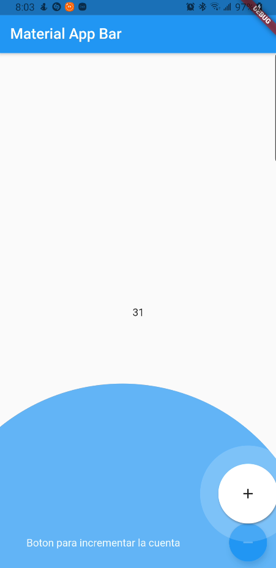

# App 13

App para practicar el uso de Hive con un contador.
Tambien se utiliza feature discovery.

## Getting Started

Recuerda que despues de clonar el proyecto, abrir una terminal dentro de la carpeta del proyecto y ejecutar el comando:

```sh
flutter packages get
``` 

## App Screenshot




